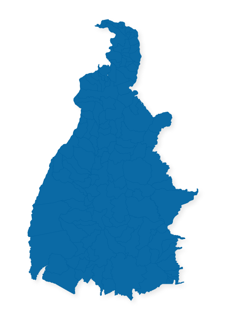

# Boletim de Conjuntura Econômica 

O # Boletim de Conjuntura Econômica 

O Boletim de Conjuntura Econômica do Tocantins é uma publicação semestral do Programa de Educação Tutorial (PET) do curso de Ciências Econômicas da Universidade Federal do Tocantins (UFT).

## :tada: Lançamentos

| :bookmark: Versão | :calendar: Data de publicação |                           :floppy_disk:                           |
| :---------------- | :---------------------------: | :---------------------------------------------------------------: |
| 2024, v. 13 nº 1  |          24/11/2025           | [Download](https://github.com/user-attachments/files/18468996/boletim_v12_n1.pdf)|   
| 2023, v. 12 nº 1  |          19/01/2025           | [Download](https://github.com/user-attachments/files/18468996/boletim_v12_n1.pdf)|   
| 2022, v. 11 nº 1  |          03/01/2024           | [Download](../../releases/download/v3.0.0/boletim_v11_n1.pdf)     |
| 2021, v. 10 nº 1  |          16/12/2022           | [Download](../../releases/download/v2.0.0/boletim.pdf)            |
| 2020, v. 9 nº 1   |          24/02/2021           | [Download](https://github.com/user-attachments/files/21006749/boletim_v9_n1.pdf) |

Versões anteriores a 2021 estão disponíveis em [histórico de lançamento](https://github.com/peteconomia/boletim-log)

## :books: Documentação

Para mais detalhe sobre a elaboração do boletim veja a [documentação](/docs)

## :grey_question: Contribuindo

Comentários, recomendações ou dúvidas podem ser submetidas abrindo uma [issue](../../issues) ou pelo email [peteconomia@uft.edu.br](mailto:peteconomia@uft.edu.br)
